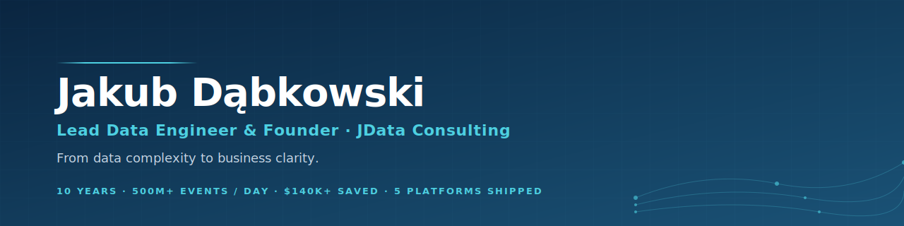

  

### From data complexity to business clarity.

Lead Data Engineer & Founder at **[JData Consulting](https://jdataconsulting.com)**.

I parachute into high-growth companies, diagnose their data challenges, and build production-grade infrastructure from the ground up. **10 years** in the complete data engineering lifecycle — architecture, pipelines, optimization, team scaling. Trusted by DoorDash, Capgemini, and VC-backed startups across adtech, e-commerce, fintech, IoT, and non-profit.

---

## What I do

| Build | Scale | Hand off |
|---|---|---|
| End-to-end data platforms from diagnosis to production. Architecture, ingestion, modelling, orchestration, observability — I own the full lifecycle. | Zero-to-fifteen engineering teams. Hiring, onboarding, mentorship. Delivery velocity without dropping standards. | Documented, tested systems your team owns on day one. No vendor lock-in, no consultant dependency. |

## Proof points

|   |   |
|---|---|
| Daily events processed in production | **500M+** at 99.99% uptime |
| Annual cost savings delivered | **$140k+** (30% compute bill cut) |
| End-to-end platforms built | **5** across adtech, fintech, e-commerce, IoT, non-profit |
| Engineering team scaled from scratch | **2 → 15** in 12 months |
| User engagement lift via funnel analytics | **+18%** |
| Data lost across 3 platform migrations | **0 rows** |

---

## Recent engagements

**VC-Backed CTV Advertising Platform** · *United States · Under NDA · 2025*
Built the real-time analytics platform from scratch. It became the company's single source of truth for executive decision-making. 500M+ daily events. 99.99% uptime. Sub-second latency. Elasticsearch indices for near real-time search with fuzzy matching, relevance tuning, and aggregation pipelines. Automated KPI monitoring catching revenue anomalies before metrics degraded.

**Top-5 UK Non-Profit Organization** · *United Kingdom · Under NDA · 2025*
Managed end-to-end AWS data platform on medallion architecture across a 6-person team. First- and third-party sources streamed through Kinesis Firehose into a unified donor-intelligence layer. Semarchy MDM for golden donor records. Zero-loss legacy CRM → Salesforce migration. Reverse-ETL pipelines pushing enriched data back to CRM, Adobe, and marketing platforms.

**AI-Powered IoT Operations Platform** · *United States · Under NDA · 2024*
Led the full data migration and analytics modernization from legacy systems to AWS (Glue, S3, Lambda) and Airflow. Grew the data function from 2 to 15 engineers in 12 months while shipping production systems on schedule. 150+ enterprise clients served. Interactive dashboards (T-SQL, Sisense, React) gave clients operational visibility that directly improved retention and upsell.

**DoorDash** · *via Capgemini Engineering · 2023–2026*
$140k annual savings by migrating Campaigns Analyzer from Snowflake to Data Lake (PySpark) — cutting a $460k compute bill by 30%. Kafka-based event-driven pipelines at scale with reliable offset management, dead-letter queues, schema-evolution handling. Zero data loss. 18% user engagement lift through consumer funnel tracking and journey mapping. Enhanced the Customer Data Platform on Databricks integrating hundreds of attributes; executed Liveramp, Acxiom, and ActionIQ integrations.

---

## Tech I build with

  

**Languages**

**Orchestration & Transformation**

**Warehouse & Lake**

**Streaming & Search**

**Cloud & IaC**

**Visualization & BI**

---

## Trusted by

- **DoorDash** *(via Capgemini Engineering)* — hundreds of millions of daily events, CDP enhancement on Databricks, Liveramp / Acxiom / ActionIQ integrations
- **Capgemini Engineering** — long-term delivery partner
- **VC-backed CTV adtech startup** *(under NDA)* — real-time analytics platform from scratch
- **Top-5 UK non-profit organization** *(under NDA)* — AWS medallion platform, MDM, Salesforce migration
- **AI-powered IoT operations platform** *(under NDA)* — full AWS modernization, team 2 → 15
- **BEC Poland** — fintech EDW modernization on Oracle

## Writing & research

- **Published paper** · *Epidemiology-constrained Seating Plan Problem* — doi: [10.2478/fcds-2022-0013](https://doi.org/10.2478/fcds-2022-0013) · Dabkowski J., Kacperski P., Kaleta M.
- **M.Eng. thesis** · *A comparative study of tools for building ETL processes* — Warsaw University of Technology, Faculty of Electronics and Information Technology
- **M.Eng. Computer Science, Intelligent Systems** · Warsaw University of Technology, 2023
- **B.Eng. Electronics & Computer Engineering** · Warsaw University of Technology, 2020

---

## GitHub activity

  
  

> A significant share of my work happens in private client repositories under NDA. What is public here is a fraction of what I build in production.

---

## Work with me

- **Website** · [jdataconsulting.com](https://jdataconsulting.com)
- **LinkedIn** · [linkedin.com/in/jakub-dabkowski](https://linkedin.com/in/jakub-dabkowski)
- **Email** · [jakub.dataconsulting@gmail.com](mailto:jakub.dataconsulting@gmail.com)
- **Based in** Warsaw, Poland · Fully remote for US & UK clients

Currently taking on **1–2 new engagements per quarter**. If you are building a data platform, scaling a team, or migrating off legacy infrastructure — let's talk.
